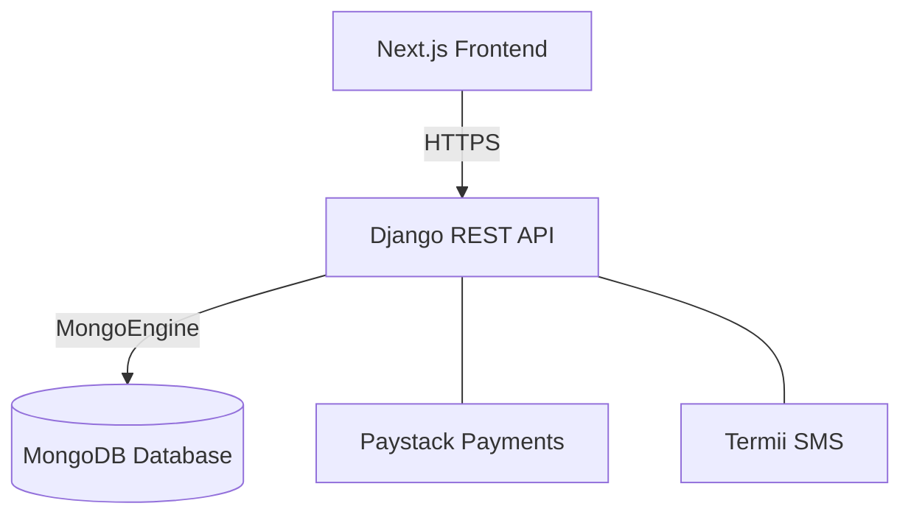
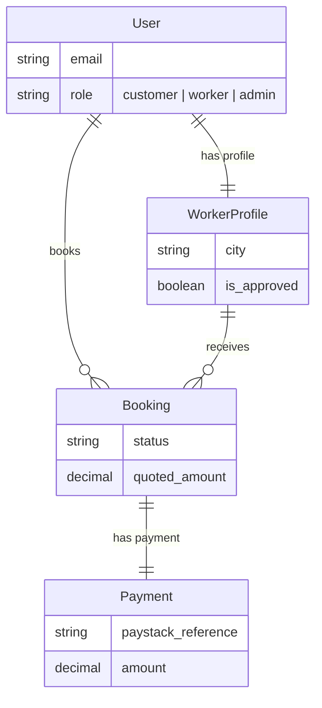
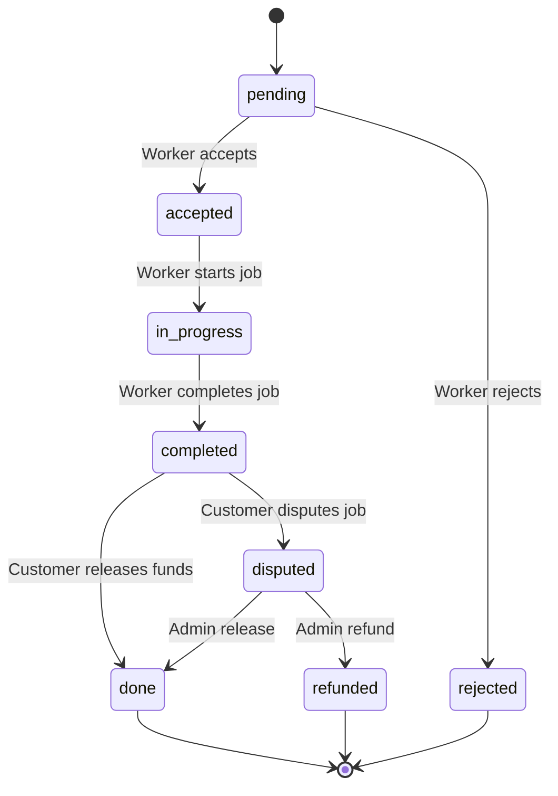
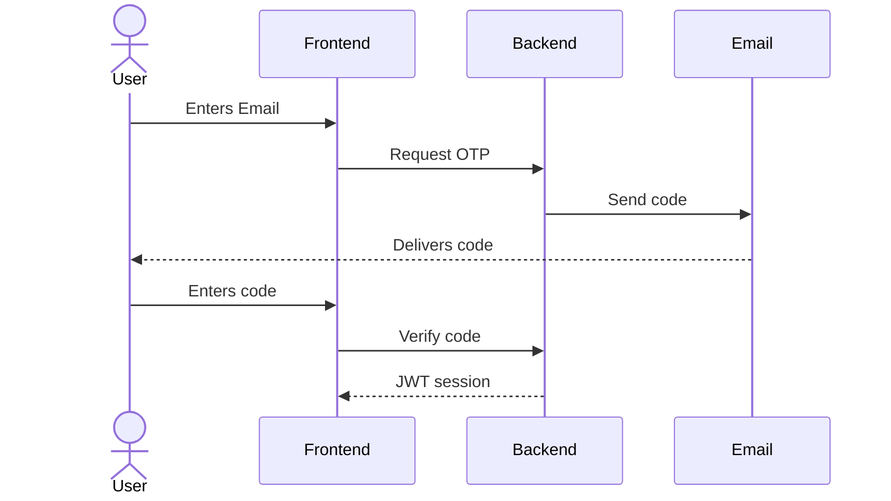
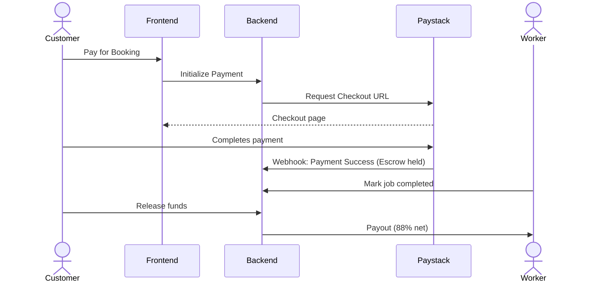
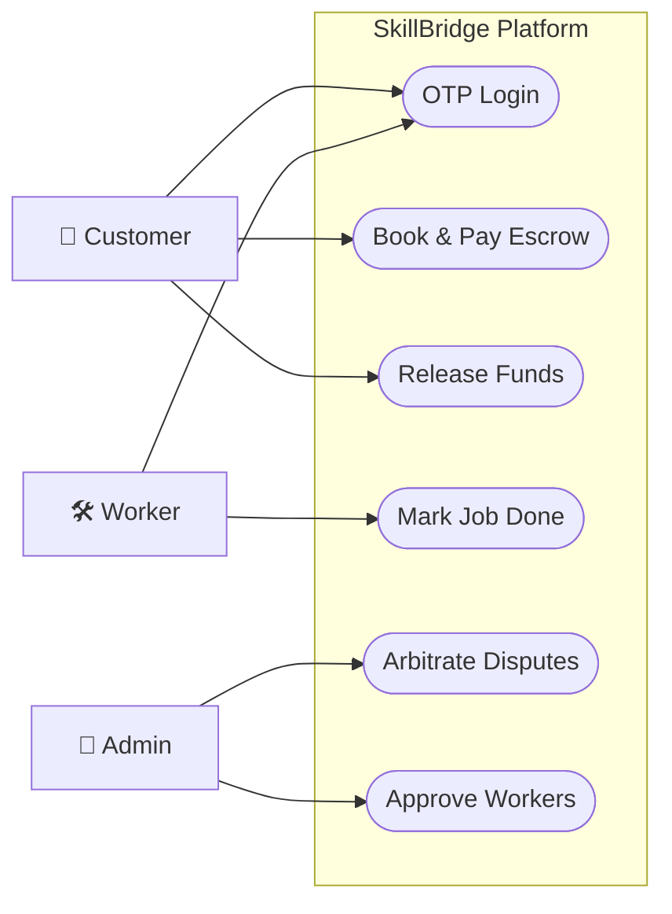
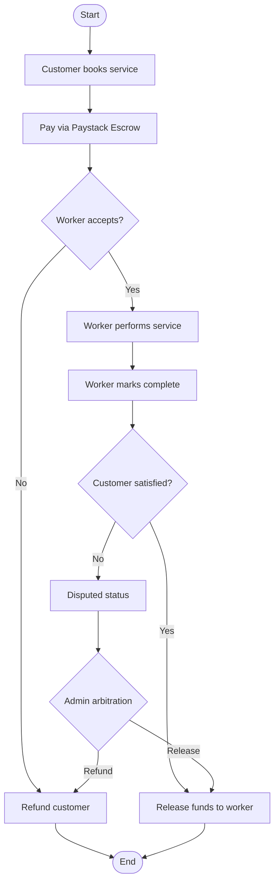

# SkillBridge Simplified Diagrams

This document contains simplified diagrams represented in Mermaid syntax, ideal for a clean and readable project report.

---

## 1. System Architecture Diagram
A simplified high-level view of the SkillBridge application architecture.

---

## 2. Database Schema (Key Collections)
An entity-relationship diagram highlighting the primary database documents and their core properties.

---

## 3. Booking Lifecycle
A streamlined state machine showing the main flow of a service booking.

---

## 4. Authentication Flow (Email OTP)
A sequence diagram representing the passwordless authentication process.

---

## 5. Paystack Escrow Payment Flow
A sequence diagram detailing the payment flow from escrow hold to final release.

---

## 6. System Use Case Diagram
Visualizes the relationship between the primary actors and the use cases in the SkillBridge platform.

---

## 7. Booking Process Flowchart
A simplified flowchart tracking the core booking and payment flow.

